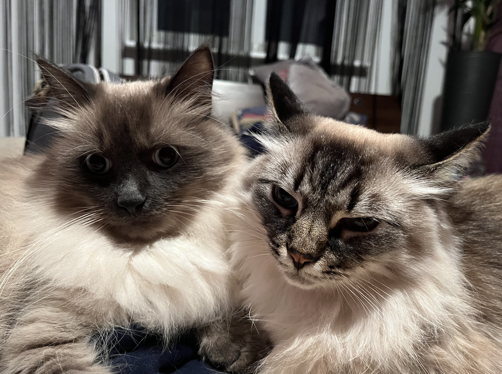

# **Cats Memory Game** 

 

## **Check It Out!**

Cats Memory Game is officially _[deployed](https://gorgeous-klepon-eecabc.netlify.app/)_! You can either click on that link, or type in this URL: <https://gorgeous-klepon-eecabc.netlify.app>.

## **Overview**

This is the codebase for my game app **Cats Memory Game**.
Using: React v18

## **Rules**

The game starts with all the cards face down and player take turn to turn over two cards. If the two cards have the same picture - then it's a match! Otherwise it turns the cards face down back again.

## **Disclaimer**

The cats on cards are actually mine. Their names are Mike and Clare.

-----
## Getting Started with **Create React App**

This project was bootstrapped with [Create React App](https://github.com/facebook/create-react-app).
